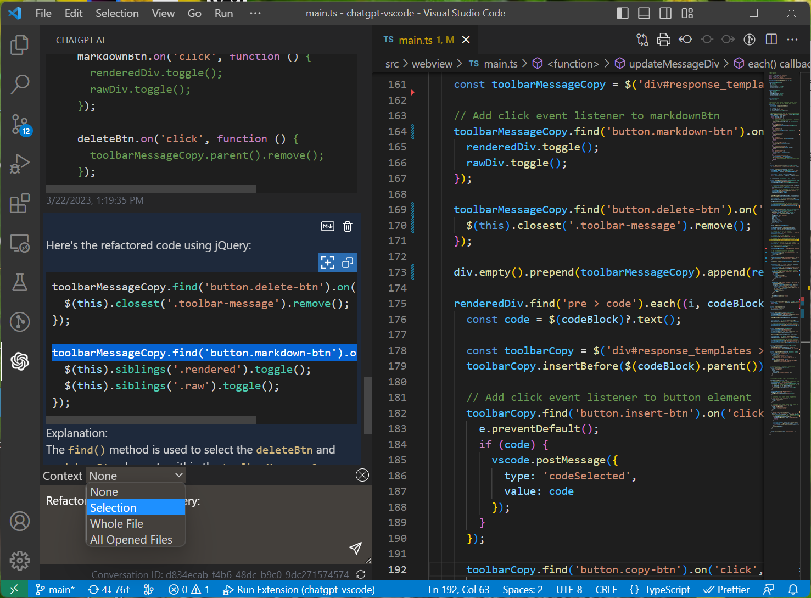

# ChatGPT extension for VSCode

[](https://github.com/yaleh/chatgpt-vscode)

ChatGPT AI is a Visual Studio Code extension that enables you to automatically write new code, ask questions, find bugs, refactor code, and more using the official OpenAI API or ChatGPT (via the [unofficial ChatGPT API](https://github.com/transitive-bullshit/chatgpt-api)). The extension provides a chat interface that you can use to interact with the AI model and get suggestions and explanations for your code.

Supercharge your coding with AI-powered assistance! Automatically write new code from scratch, ask questions, get explanations, refactor code, find bugs and more 🚀✨

## 03/01/2023: Introducing the official ChatGTP API! Now supported with the powerful gpt-3.5-turbo-0301 model.

### Links:

- **[Github Repository](https://github.com/yaleh/chatgpt-vscode)**
- **[Visual Studio Code Marketplace](https://marketplace.visualstudio.com/items?itemName=YaleHuang.chatgpt-ai)**

<br>



## Features
- 💡 **Ask general questions** or use code snippets from the editor to query ChatGPT via an input box in the sidebar
- 🖱️ Right click on a code selection and run one of the context menu **shortcuts**
	- automatically write documentation for your code
	- explain the selected code
	- refactor or optimize it
	- find problems with it
	- complete the code according to the comments
- 💻 View ChatGPT's responses in a panel next to the editor
- 🚀 See the response as it is being generated **in real time**
- 💬 Ask **follow-up questions** to the response (conversation context is maintained)
- 📝 **Insert code snippets** from the AI's response into the active editor or **copy code snippets** by clicking on them

## Requirements
ChatGPT AI requires Visual Studio Code version 1.73.0 or later to be installed on your system.

## Installation

To use this extension, install it from the VSCode marketplace.

1. After the installation is complete, you will need to add your OpenAI API key to the extension settings in VSCode. To do this, open the `Settings` panel by going to the `File` menu and selecting `Preferences`, then `Settings`.
2. In the search bar, type `ChatGPT` to filter the settings list.
3. In the ChatGPT section, enter your API key in the top field

After completing these steps, the extension should be ready to use.

## API Modes

Currently, there are two modes for accessing the API: "ChatGPTAPI" and "ChatGPTUnofficialProxyAPI".
### ChatGPTAPI

To use this extension, you will need an `API key` from OpenAI. To obtain one, follow these steps:

1. Go to [OpenAI's website](https://platform.openai.com/account/api-keys). If you don't have an account, you will need to create one or sign up using your Google or Microsoft account.
2. Click on the `Create new secret key` button.
3. Copy the key and paste it into the `API Key` field in the extension settings.

### ChatGPTUnofficialProxyAPI

To use the ChatGPTUnofficialProxyAPI, you need an OpenAI access token from the ChatGPT web app. You can obtain the access token in either of two ways:

* Use acheong08/OpenAIAuth, which is a Python script to automatically log in and get an access token. This method works only with email and password accounts; it does not support accounts where you authenticate via Microsoft or Google.
* Manually get an access token by logging in to the ChatGPT web app and opening https://chat.openai.com/api/auth/session, which will return a JSON object containing your access token string.

Access tokens last for approximately eight hours.

## Building from source (not applicable for VSCode marketplace version)

To build the extension from source, clone the repository and run `npm install` to install the dependencies. You have to change some code in `chatgpt` module because VSCode runtime does not support `fetch`. Open `node_modules/chatgpt/dist/index.js` and add the following code at the top of the file:

```js
import fetch from 'node-fetch'
```

Then remove the following lines (around line 15):

```js
// src/fetch.ts
var fetch = globalThis.fetch;
if (typeof fetch !== "function") {
  throw new Error("Invalid environment: global fetch not defined");
}
```

You also need to copy `encoder.json` and `vocab.bpe` from `node_modules/gpt-3-encoder/` into `dist/` folder. You can do this by running the following commands:

```bash
cp node_modules/gpt-3-encoder/{encoder.json,vocab.bpe} dist/
```

## Using the Extension

To use the extension, open a text editor in Visual Studio Code and open the ChatGPT panel by clicking on the ChatGPT icon in the sidebar. This will open a panel with an input field where you can enter your prompt or question. By clicking enter, it will be sent to ChatGPT. Its response will be displayed below the input field in the sidebar (note that it may take some time for it to be calculated).


You can also select a code snippet in the editor and then enter a prompt in the side panel, or right-click and select "Ask ChatGPT". The **selected code will be automatically appended** to your query when it is sent to the AI. This can be useful for generating code snippets or getting explanations for specific pieces of code.


To **insert a code snippet** from the AI's response into the editor, simply click on the code block in the panel. The code will be automatically inserted at the cursor position in the active editor.


You can select some code in the editor, right click on it and choose one of the following **shortcuts** from the context menu:
#### Commands

The following commands are available:

* Ask ChatGPT: This command will provide a prompt for you to enter any query.
* ChatGPT: Explain selection: This command will explain what the selected code does.
* ChatGPT: Refactor selection: This command will attempt to refactor the selected code.
* ChatGPT: Find problems: This command will look for problems/errors in the selected code, fix them, and provide an explanation.
* ChatGPT: Optimize selection: This command will attempt to optimize the selected code.
* ChatGPT: Complete code: This command will complete the code according to the last comments of the selection.

`Ask ChatGPT` is also available when nothing is selected. For the other four commands, you can **customize the exact prompt** that will be sent to the AI by editing the extension settings in VSCode Preferences.


Because ChatGPT is a conversational AI, you can ask follow-up questions to the response. The conversation context is maintained between queries, so you can ask multiple questions in a row. 
To **reset the conversation context**, click `ctrl+shift+p` and select `ChatGPT: Reset Conversation`.

---

Please note that this extension is currently a proof of concept and may have some limitations or bugs. We welcome feedback and contributions to improve the extension. Also check out [CodeGPT](https://github.com/timkmecl/codegpt) extension that uses official OpenAI API and also supports other GPT3 models.

## License

ChatGPT AI is licensed under the MIT License. See the LICENSE file for more information.

## Credits

- This wouldn't be possible without OpenAI's [ChatGPT](https://chat.openai.com/chat)
- The extension makes use of [chatgpt-api](https://github.com/transitive-bullshit/chatgpt-api) (by [Travis Fischer](https://github.com/transitive-bullshit)), which uses unofficial ChatGPT API in order to login and communicate with it.
- The project was started by [mpociot](https://github.com/mpociot/) and [timkmecl](https://github.com/timkmecl)
- `v0.3` inspired by [barnesoir/chatgpt-vscode-plugin](https://github.com/barnesoir/chatgpt-vscode-plugin) and [gencay/vscode-chatgpt](https://github.com/gencay/vscode-chatgpt)